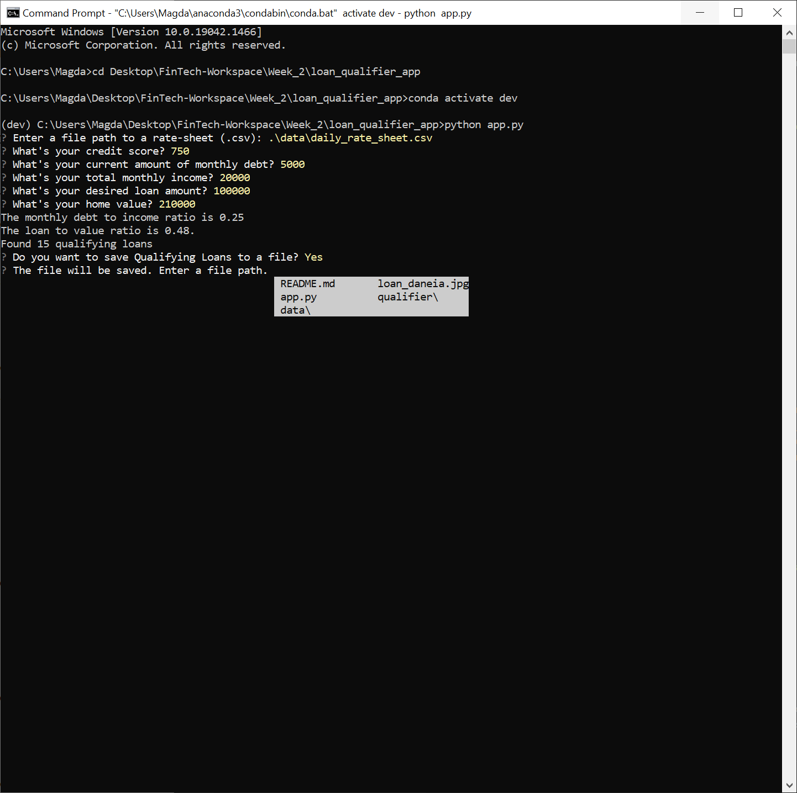

# Loan Qualifier Application

This is a python command-line interface application for saving the qualifying loans to a new CSV file. The application takes in a `daily_rate_sheet` of loan criteria from various loan providers, asking the user a number of questions to evaluate their loan eligibility, creating a list of qualifying loans, asking whether the user wants to save this list and asks for the output file path. 

---

## Technologies

This project leverages python 3.7 with the following packages:

* [fire](https://github.com/google/python-fire) - library for automatically generating command line interfaces (CLIs)

* [questionary](https://github.com/tmbo/questionary) - library for interactive user prompts and dialogs

* [csvkit](https://docs.python.org/3/library/csv.html) - module for importing and exporting spreadsheets and databases in Comma Separated Values format

* [sys](https://docs.python.org/3/library/sys.html) - module that provides access to some variables used or maintained by the interpreter and to functions that interact strongly with the interpreter

---

## Installation Guide

You need to install the following dependencies before you run the application:

```python
  pip install fire
  pip install questionary
  pip install csvkit
```

---

## Usage

Before using the loan qualifier application clone the repository and run the **app.py** with:

```python
python app.py
```

When the loan qualifier application opens, you will see the following prompts:


---

## Contributors

Author: Magdalena Svimberska
email: magdalena.svimberska@gmail.com

---

## License

GNU General Public License